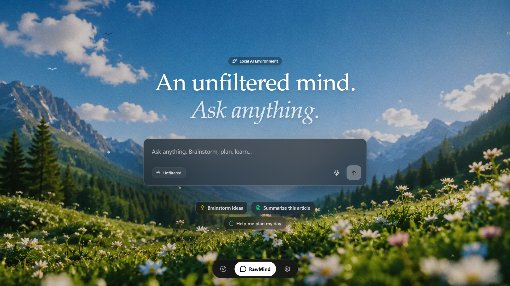

  
  <h1>RawMind</h1>
  
<strong>Turn your intent into better discovery, better questions, and better media.</strong>

  
  
  

   
  

    <a href="https://rawmind.maanis.dev/">Live Demo</a> •
    <a href="#what-rawmind-does">What it does</a> •
    <a href="#why-it-helps-you">Why it helps</a>
  

---

## 🧠 What RawMind does

RawMind is an AI-powered discovery experience that helps you move from a vague idea to a more relevant stream of content and conversations.

Instead of searching endlessly, you can describe what you want in plain language, speak naturally, or explore a topic through a persona-based chat. The app then helps surface the most relevant videos, ideas, and follow-up questions for your intent.

This makes it useful for:

- discovering content that matches your goal rather than just your keywords
- exploring a topic with a more conversational, guided AI experience
- getting a better match between what you want and what you watch
- turning curiosity into a personalized media flow

---

## ✨ Why it helps you

- 🎯 Intent-first discovery: find content based on what you mean, not only what you type
- 🗣️ Voice-friendly interaction: speak your idea and let the app interpret it
- 🧠 AI ranking and relevance: videos are evaluated against your intent and context
- 💬 Persona-based chat: explore topics through different tones and styles
- 🔄 Adaptive learning: the experience evolves as you watch and interact

RawMind is built for people who want a smarter way to explore ideas, refine their interests, and discover media that feels more aligned with what they actually need.

---

## 🌐 Try it live

Visit the app here: https://rawmind.maanis.dev/

---

## 📌 Built for curious minds

RawMind helps you move faster from intention to insight, making exploration feel more personal, more helpful, and more focused.

  <i>Built for curiosity, clarity, and smarter discovery.</i>

